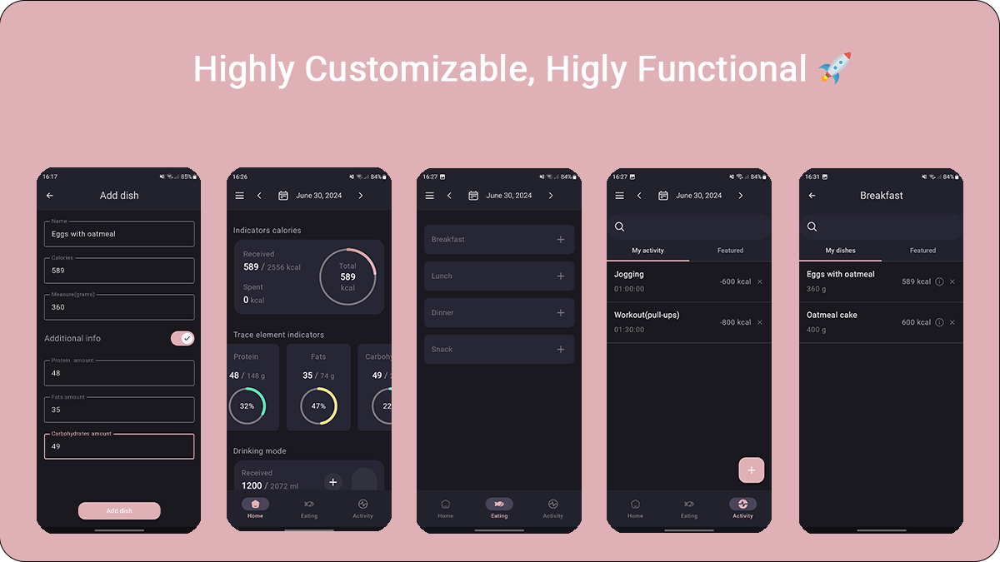

# CalorieCounter

### A minimalistick and powerful nutrients, calories, and activities indicators app for Android!

## Features
- Modern and easy to use interface
- Your statistics for all days
### Calories and nutrients
- Highly customizable nutrients indicators
- Very convinient calories statisticks for each day
- Water statistics
### Eating
- Create highly customizable dishes
- Add dishes to featured
- Create dishes for all meal times
- Configure how many portions of dish you eat
- Find dishes by search bar
### Activities
- Create highly customizable activites
- Add activities to featured
### Alarms
- Customizable schedules for each meal time
- Option to enable or disable alarms
### Appearance
- Material You theme
- You can use one of 5 different ui color theme
### Calculations
- All calcultions made with Harris-Benedict formula
### Design
- Insipired by this [design](https://www.behance.net/gallery/91770367/Calorie-Counter-App)
